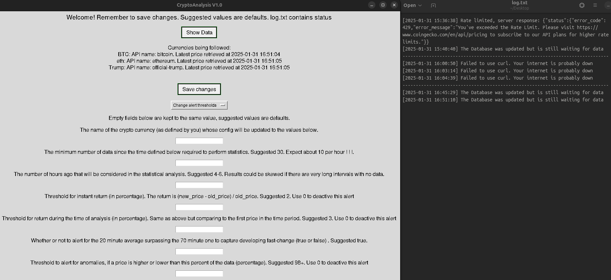

# Real-time crypto currency analyzer

## Description
This program is a real-time analyzer of the crypto currency market with SMTP or local alerts. Its biggest benefit is the capacity to follow an arbitrarily large number of crypto currencies at the same time, while defining for each one different thresholds to receive alerts. The program consists of a GUI that acts as the hub while other parts connect to the CoinGecko API. This program is great for short term analysis which makes it very strong to follow volatile crypto currencies where change develops fast. 

## Characteristics
- GUI: Add or remove crypto curencies, change the threshold for each one, and change program configuration like refresh interval and type of alert.
- Statistical parameters are calculated with Pandas, they include: Instant and time window return, moving averages, statistical anomalies, etc.
- SQLite storage: Stores every price, date and configuration locally using SQLite.
- Log: Log current program status, errors, API down or API rate-limited, and optionally write the statistical alerts to this file.

## Usage
- Compile the Makefile simply using the command "make", then execute the program.
- Leave the GUI open while data is gathered and analyses are conducted.
